# yolov8-visualizations

基于anchor free的Yolov8的Detect Layer可视化。如果你想看之前的基于Anchor Based+NMS的可视化，你可以移步[**Yolo-Detect-Layer-Visualization**](https://github.com/XiaMooo/Yolo-Detect-Layer-Visualization)。

测试基于用于目标检测的[yolov8m.pt](https://github.com/ultralytics/assets/releases/download/v0.0.0/yolov8m.pt)（尚未正式发布、发论文），你可以在ultralytics-yolov8的官方仓库[Ultralytics YOLOv8](https://github.com/ultralytics/ultralytics)中获取。你需要手动下载到pt文件，然后请放到weights目录下。

实例分割的vis我鸽一下，最近爷很懒。

在yolov8中，以yolov8m为例，输入一个NCHW (n, 3, 640, 640)的张量，会得到一个（n, 84, 8400）的张量（其实还有一个包含p3 p4 p5三个尺寸的144维张量但我还没看出有啥屌用），其中84表示4个方向维度XYWH以及80个物体种类（coco80数据集的nc:=80），各个目标种类的index和name你可以通过YOLO.model.names获得。输入和输出的onnx数据流如下图所示：

> 
>
> + 输入
>
>   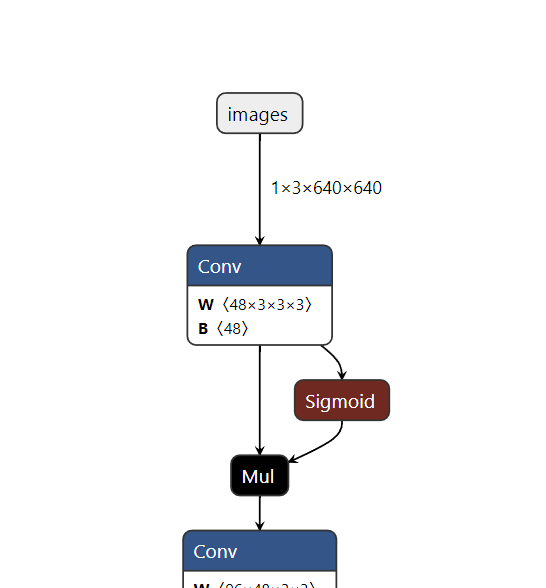
>
> + 输出
>
>   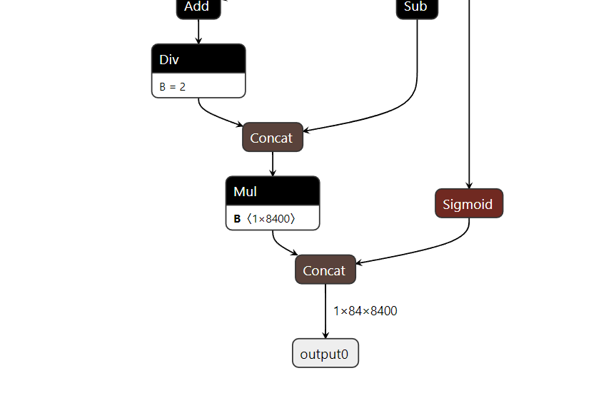

运行[detect-vis.ipynb的jupyter文件](./detect-vis.ipynb)以获取更多细节。

## 一些可视化示例

> ###### bus.jpg
>
> 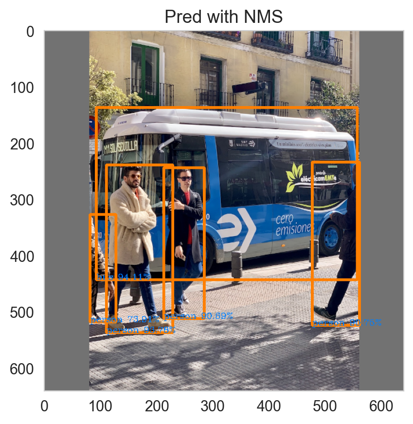
>
> 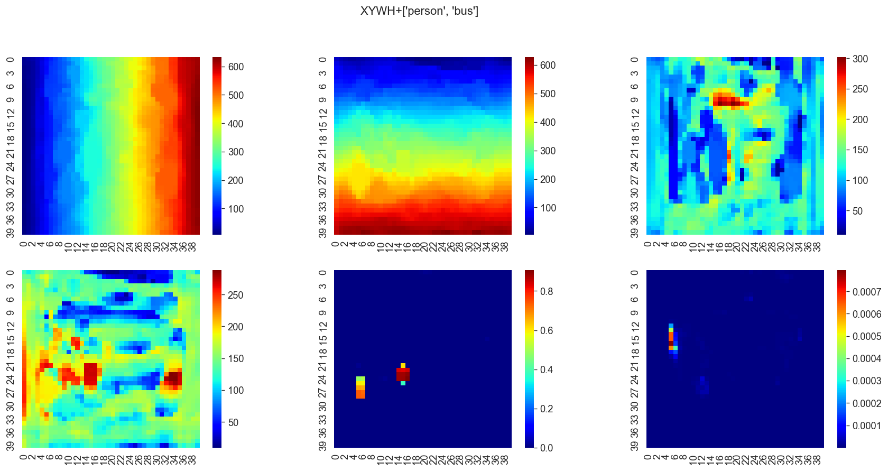
>
> 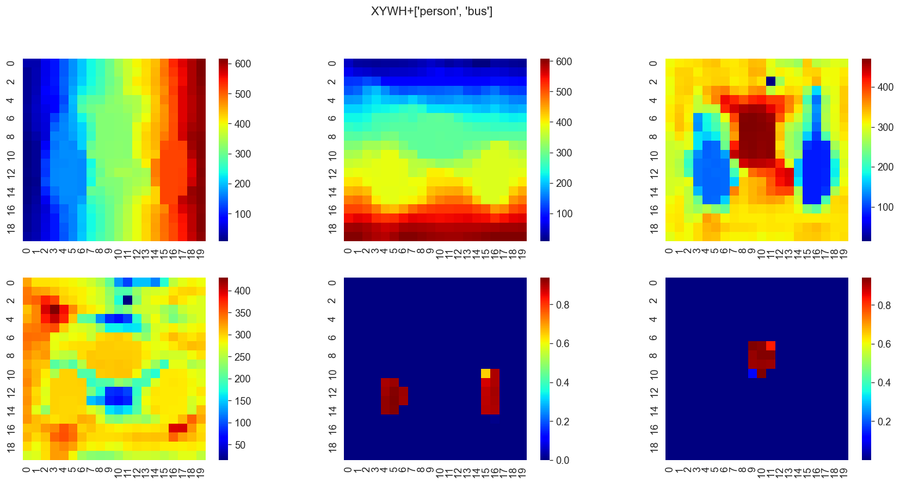
>
> 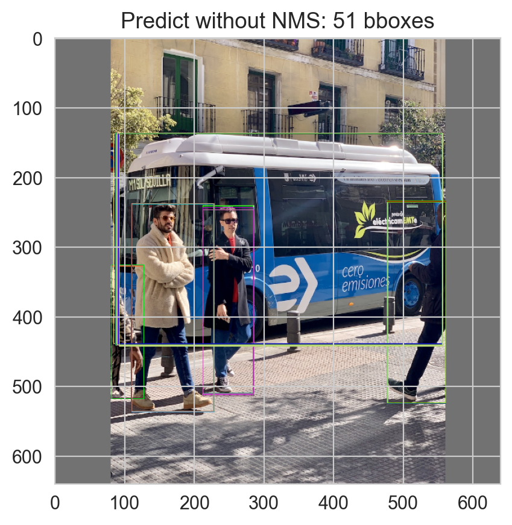

> ###### image1.jpg
>
> 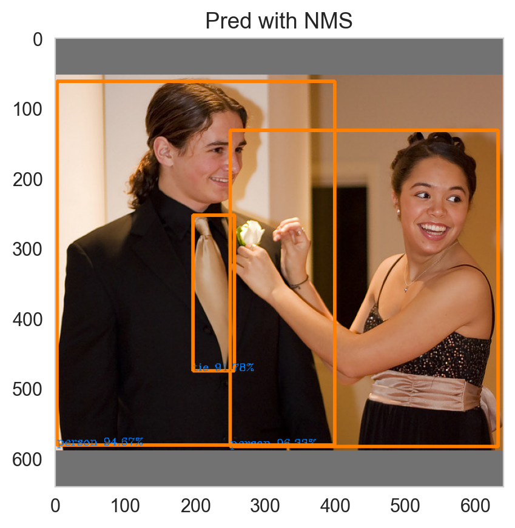
>
> 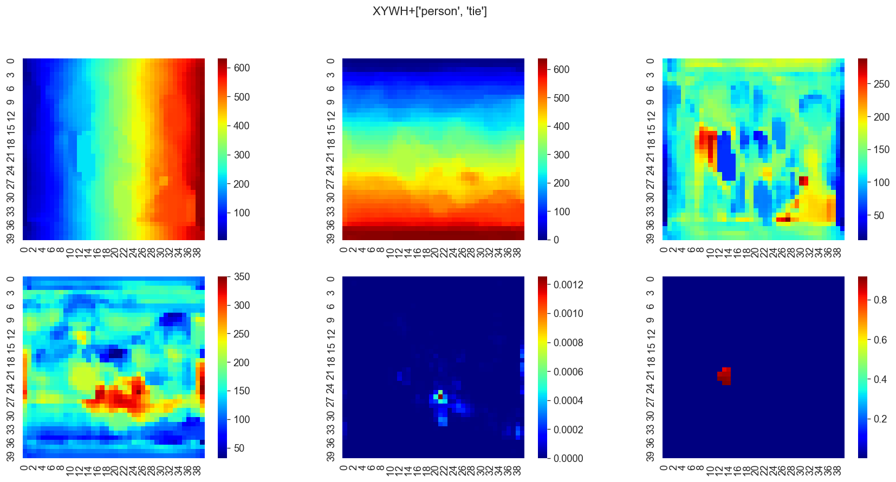
>
> 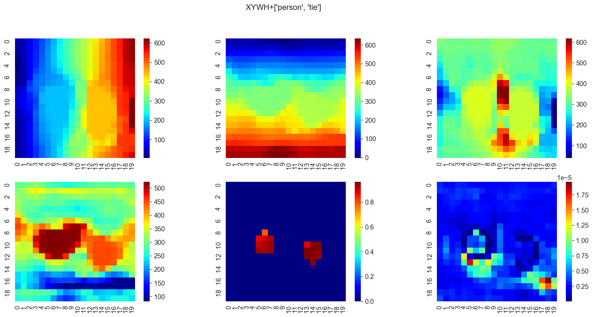

> ###### image3.jpg
>
> 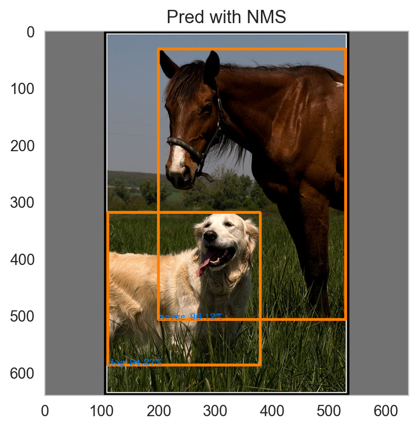
>
> 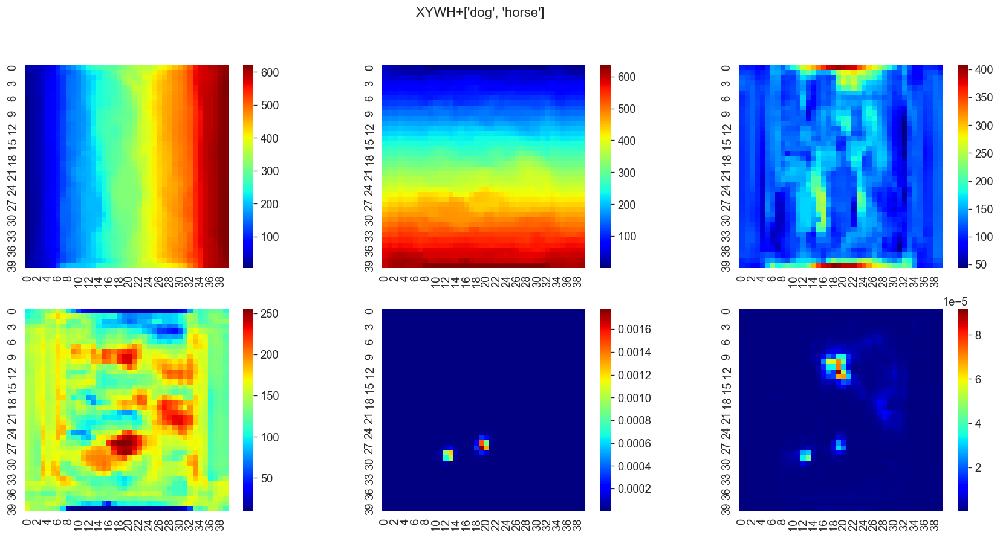
>
> 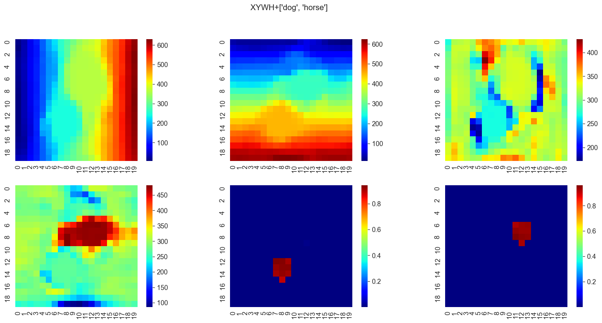
